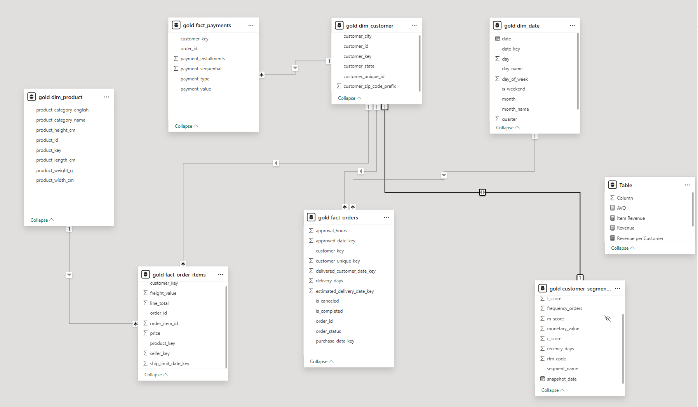

# Retail Customer Segmentation (SQL Server → Power BI) — End to End

## Overview

This project builds an end-to-end analytics pipeline for **customer segmentation** using the Olist retail dataset.
It starts from raw CSV files and ends with a Power BI dashboard built on a **Gold star schema** and an **RFM-based customer segmentation snapshot**.

**Tech Stack**

* SQL Server (SSMS)
* T-SQL (Bronze → Silver → Gold)
* Power BI (data model + visuals)

---

## Dataset

Source: Olist Brazilian E-commerce dataset (CSV files: customers, orders, items, payments, reviews, products, sellers, geolocation, category translation).

---

## Architecture (Bronze → Silver → Gold)

### Bronze (Raw Landing)

Goal: ingest CSV files **as-is** with minimal friction.

* Tables created under `bronze` schema
* Columns stored as `NVARCHAR` to avoid type inference errors during ingestion
* Data loaded via `BULK INSERT` (scripted and repeatable)

**Scripts**

* `scripts/bronze/01_ddl_bronze.sql` — create bronze schema + raw tables
* `scripts/bronze/02_load_bronze.sql` — load CSVs into bronze tables

---

### Silver (Typed + Clean)

Goal: convert raw text to typed, cleaned, and join-ready tables.

* Cast and standardize:

  * timestamps → `DATETIME2`
  * numeric fields → `INT` / `DECIMAL`
* Basic cleanup:

  * trimming, null handling
  * deduping by business keys
* Relationship integrity checks (orphans, null keys, date logic, negative values)

**Scripts**

* `scripts/silver/03_ddl_silver.sql` — create typed silver tables
* `scripts/silver/04_load_silver.sql` — transform Bronze → Silver
* `scripts/silver/05_silver_sanity_checks.sql` — quality + integrity checks

---

### Gold (Analytics Star Schema)

Goal: build a Power BI-friendly model (dims + facts).

**Dimensions**

* `gold.dim_date`
* `gold.dim_customer`
* `gold.dim_product`
* `gold.dim_seller`

**Facts**

* `gold.fact_orders` (order grain)
* `gold.fact_order_items` (line item grain)
* `gold.fact_payments` (payment grain)

**Scripts**

* `scripts/gold/06_ddl_gold.sql` — create star schema (dims + facts)
* `scripts/gold/07_load_gold.sql` — load Gold tables from Silver

---

## Customer Segmentation (RFM)

Goal: generate a 1-row-per-customer segmentation snapshot.

* **Recency**: days since last purchase
* **Frequency**: number of non-canceled orders
* **Monetary**: total payment value
* Scores computed using `NTILE(5)` for R/F/M
* Segment labels assigned (Champions, Loyal, Needs Attention, At Risk, Lost)

**Script**

* `scripts/gold/08_customer_segmentation_snapshot.sql`

Example segment distribution:

* Needs Attention: 31,752
* Loyal: 23,023
* Champions: 16,259
* At Risk: 15,141
* Lost: 12,032

---

## Power BI Dashboard

The dashboard connects to the **Gold layer only** (no Bronze/Silver used in reporting).

### Data Model

Star schema with relationships between dims and facts + segmentation table.

### Pages

1. **Overview**

* KPIs: Revenue, Total Orders, Total Customers, AOV
* Revenue by Segment

2. **Segmentation Deep Dive**

* Segment table (Customers, Orders, AOV)
* Segment distribution

3. **Category x Segment**

* Revenue (Items + Freight) matrix by product category and segment

4. **At Risk Target List**

* Customer list (recency, frequency, monetary) filtered to At Risk / Lost

> Add your screenshots here:

* `/assets/overview.png`
* `/assets/segmentation-deep-dive.png`
* `/assets/category-x-segment.png`
* `/assets/at-risk-target-list.png`

---

## Key Measures (Power BI)

Core metrics:

* Revenue (Payments)
* Orders
* Customers
* AOV
* Revenue per Customer
* Item Revenue (Items + Freight) for category analysis

---

## How to Run

### 1) Bronze

Run:

1. `01_ddl_bronze.sql`
2. `02_load_bronze.sql`

### 2) Silver

Run:
3. `03_ddl_silver.sql`
4. `04_load_silver.sql`
5. `05_silver_sanity_checks.sql` (validate)

### 3) Gold

Run:
6. `06_ddl_gold.sql`
7. `07_load_gold.sql`
8. `08_customer_segmentation_snapshot.sql`

### 4) Power BI

* Connect Power BI to SQL Server database `RetailSegmentation`
* Import Gold tables
* Build relationships + measures
* Create visuals

---

## Notes / Design Decisions

* Bronze uses text-first ingestion to avoid CSV type inference issues.
* Silver handles typing + cleaning so Gold stays analytics-focused.
* Gold is modeled as a star schema for performance and clean BI relationships.
* Segmentation uses payments for monetary value (most reliable revenue proxy).

---

## Next Improvements

* Segment based on `customer_unique_id` (true unique customer identity) in addition to `customer_id`
* Add cohort analysis (first purchase month → retention)
* Add churn prediction features (delivery delays, review scores, category affinity)
* Add incremental refresh support for larger datasets

---

